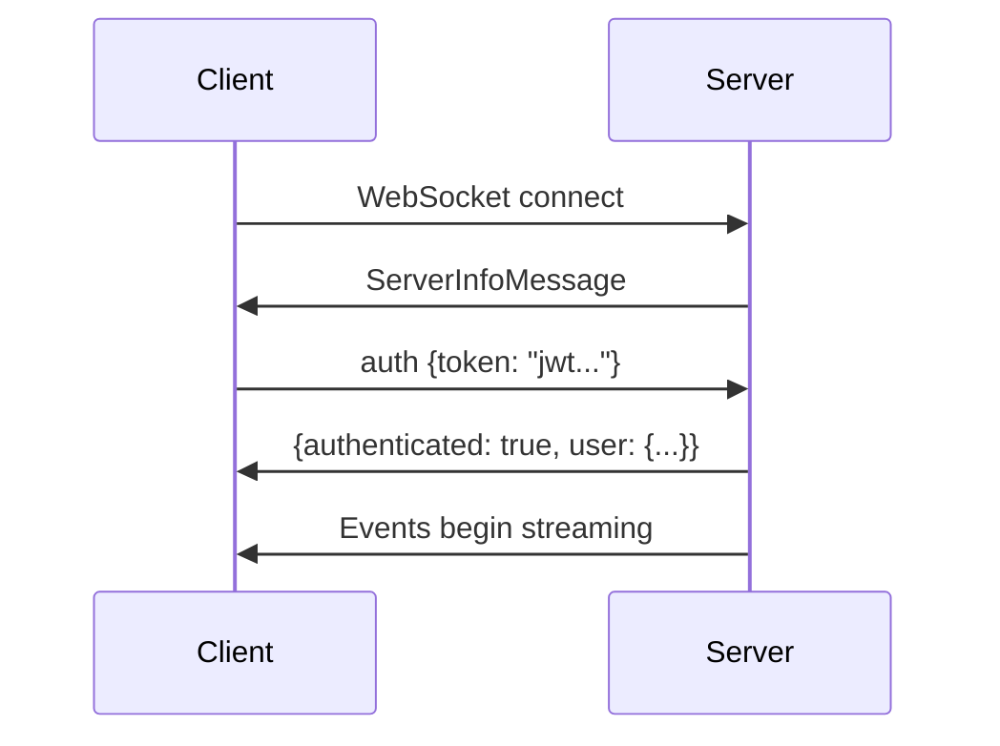

# Music Assistant API

This page documents the Music Assistant WebSocket API as used by the KDE client.

## Connection

### Endpoint

```
ws://<host>:<port>/ws
```

Default port is **8095**.

### Protocol

JSON messages over WebSocket. Three message types:

=== "Command (Client → Server)"

    ```json
    {
      "message_id": "1",
      "command": "players/all",
      "args": {}
    }
    ```

=== "Success Response (Server → Client)"

    ```json
    {
      "message_id": "1",
      "result": [...],
      "partial": false
    }
    ```

=== "Error Response (Server → Client)"

    ```json
    {
      "message_id": "1",
      "error_code": 23,
      "details": "Error description"
    }
    ```

=== "Event (Server → Client)"

    ```json
    {
      "event": "player_updated",
      "object_id": "player_id_here",
      "data": { ... }
    }
    ```

### Partial Results

Large result sets (e.g., library listings) are streamed in 500-item batches. Messages with `"partial": true` contain a chunk; the final message has `"partial": false`. Accumulate all chunks to build the complete result.

## Authentication

### Connection Flow



### ServerInfoMessage

Sent immediately on connect:

```json
{
  "server_id": "uuid",
  "server_version": "2.8.0",
  "schema_version": 29,
  "base_url": "http://host:8095",
  "status": "running"
}
```

!!! important
    Wait for `ServerInfoMessage` before sending any commands. Sending commands before the server is ready will fail.

### auth Command

```json
{"message_id": "1", "command": "auth", "args": {"token": "eyJ..."}}
```

Response:

```json
{
  "message_id": "1",
  "result": {
    "authenticated": true,
    "user": {
      "user_id": "...",
      "username": "user@example.com",
      "role": "admin",
      "display_name": "User Name"
    }
  }
}
```

### auth/login Command

```json
{
  "message_id": "1",
  "command": "auth/login",
  "args": {
    "username": "user",
    "password": "pass",
    "provider_id": "builtin",
    "device_name": "Music Assistant Native"
  }
}
```

Response:

```json
{
  "message_id": "1",
  "result": {
    "success": true,
    "access_token": "eyJ...",
    "user": { ... }
  }
}
```

!!! warning "Key name is `access_token`, not `token`"
    The login response uses `access_token`. The auth command uses `token` in its args. These are different field names.

## Player Commands

| Command | Args | Description |
|---------|------|-------------|
| `players/all` | — | List all players |
| `players/get` | `player_id` | Get single player state |
| `players/cmd/play` | `player_id` | Start playback |
| `players/cmd/pause` | `player_id` | Pause playback |
| `players/cmd/play_pause` | `player_id` | Toggle play/pause |
| `players/cmd/stop` | `player_id` | Stop playback |
| `players/cmd/next` | `player_id` | Next track |
| `players/cmd/previous` | `player_id` | Previous track |
| `players/cmd/seek` | `player_id, position` | Seek to position (seconds) |
| `players/cmd/volume_set` | `player_id, volume_level` | Set volume (0–100) |
| `players/cmd/volume_up` | `player_id` | Increment volume |
| `players/cmd/volume_down` | `player_id` | Decrement volume |
| `players/cmd/volume_mute` | `player_id, muted` | Set mute state |
| `players/cmd/power` | `player_id, powered` | Set power state |

## Queue Commands

| Command | Args | Description |
|---------|------|-------------|
| `player_queues/all` | — | List all queues |
| `player_queues/get` | `queue_id` | Get queue state |
| `player_queues/items` | `queue_id, limit, offset` | Get queue items |
| `player_queues/play_media` | `queue_id, media, option` | Play media URI(s) |
| `player_queues/play_index` | `queue_id, index` | Jump to queue position |
| `player_queues/play` | `queue_id` | Resume playback |
| `player_queues/pause` | `queue_id` | Pause |
| `player_queues/next` | `queue_id` | Next track |
| `player_queues/previous` | `queue_id` | Previous track |
| `player_queues/seek` | `queue_id, position` | Seek (seconds) |
| `player_queues/shuffle` | `queue_id, shuffle_enabled` | Set shuffle |
| `player_queues/repeat` | `queue_id, repeat_mode` | Set repeat (off/one/all) |
| `player_queues/delete_item` | `queue_id, item_id_or_index` | Remove item |
| `player_queues/clear` | `queue_id` | Clear queue |

### play_media Options

| Option | Behavior |
|--------|----------|
| `play` | Play immediately |
| `replace` | Replace queue and play |
| `next` | Insert after current track |
| `replace_next` | Replace upcoming tracks |
| `add` | Append to end of queue |

## Library Commands

### Generic

| Command | Args | Description |
|---------|------|-------------|
| `music/search` | `search_query, limit` | Search across all types |
| `music/{type}/library_items` | `limit, offset, favorite` | List library items |
| `music/{type}/count` | — | Count library items |

Where `{type}` is: `artists`, `albums`, `tracks`, `playlists`, `radios`

### Type-Specific

| Command | Args | Description |
|---------|------|-------------|
| `music/albums/album_tracks` | `item_id, provider_instance_id_or_domain` | Album track listing |
| `music/artists/artist_albums` | `item_id, provider_instance_id_or_domain` | Artist's albums |
| `music/tracks/similar_tracks` | `item_id, provider_instance_id_or_domain` | Similar tracks |
| `music/playlists/playlist_tracks` | `item_id, provider_instance_id_or_domain` | Playlist contents |
| `music/favorites/add_item` | `item` (URI) | Add to favorites |
| `music/favorites/remove_item` | `media_type, library_item_id` | Remove from favorites |

## Events

After authentication, events are pushed automatically:

| Event | object_id | data | Used For |
|-------|-----------|------|----------|
| `player_updated` | player_id | Player | Update player state/UI |
| `player_added` | player_id | Player | Add to player list |
| `player_removed` | player_id | — | Remove from player list |
| `queue_updated` | queue_id | PlayerQueue | Update queue state |
| `queue_items_updated` | queue_id | — | Trigger queue re-fetch |
| `queue_time_updated` | queue_id | float | Update elapsed time |

## Image Proxy

```
GET /imageproxy?path={url_encoded_path}&provider={provider_id}&size={pixels}
```

- Returns JPEG/PNG image data
- `size` parameter controls the maximum dimension for resizing
- The proxy caches images and can resize remote URLs
- May require `Authorization: Bearer <token>` header depending on server configuration

## URI Format

```
{provider_domain}://{media_type}/{item_id}
```

Examples:

- `spotify://track/4uLU6hMCjMI75M1A2tKUQC`
- `library://album/42`
- `tidal://artist/1234`

## Heartbeat

The client should send periodic pings to keep the connection alive:

```json
{"message_id": "ping", "command": "ping"}
```

Recommended interval: **25 seconds**. The server times out connections after ~60 seconds of inactivity.
