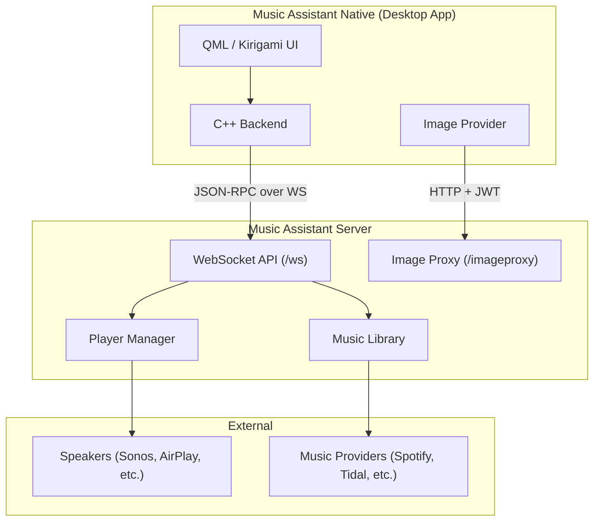
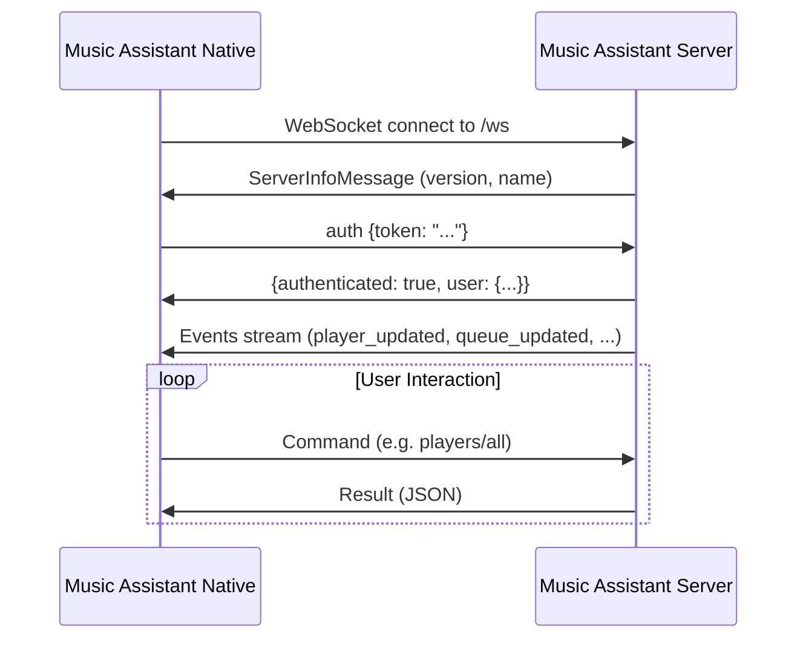
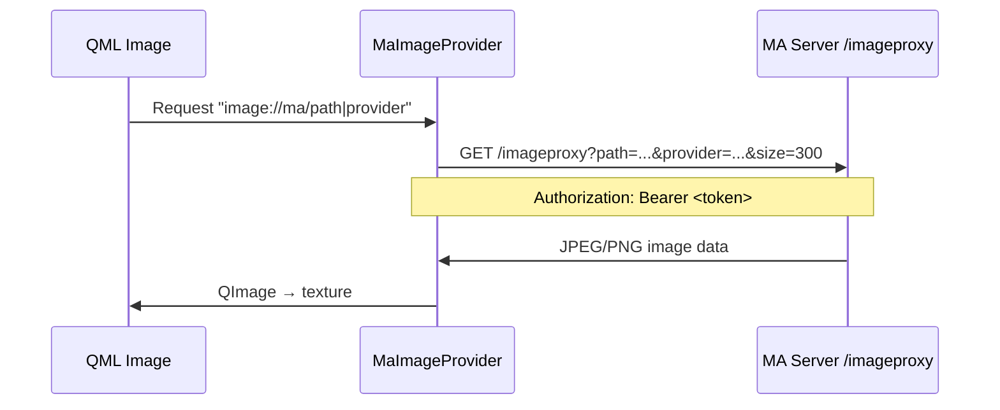

# Architecture

## Overview

Music Assistant Native is a native Qt6/KDE Frameworks 6 application that acts as a remote control for a Music Assistant server. All audio processing and streaming happens server-side — the app communicates over WebSocket.



## Technology Stack

| Layer | Technology | Purpose |
|-------|-----------|---------|
| UI | QML + Kirigami | Declarative, Plasma-native interface |
| Backend | C++20 | WebSocket client, data models, controllers |
| Build | CMake + ECM | KDE-standard build system |
| Packaging | RPM | Fedora distribution |
| Communication | WebSocket JSON-RPC | Real-time bidirectional with MA server |
| Images | Qt Image Provider | Async album art loading via HTTP |

## Component Overview

```
src/
├── main.cpp                 # App bootstrap, singleton wiring
├── maclient.h/cpp           # WebSocket client (core)
├── playercontroller.h/cpp   # Player state & commands
├── queuecontroller.h/cpp    # Queue state & commands
├── librarycontroller.h/cpp  # Library browsing & search
├── mediaitemmodel.h/cpp     # QAbstractListModel for media items
├── playermodel.h/cpp        # QAbstractListModel for players
├── queueitemmodel.h/cpp     # QAbstractListModel for queue items
├── imageprovider.h/cpp      # QQuickAsyncImageProvider
└── qml/
    ├── Main.qml             # App window, navigation, bottom bar
    ├── NowPlayingPage.qml   # Current track, art, controls
    ├── LibraryPage.qml      # Tabbed library browser
    ├── MediaItemDelegate.qml # Reusable list item delegate
    ├── QueuePage.qml        # Queue management
    ├── PlayersPage.qml      # Player list & volume
    └── SettingsPage.qml     # Server connection config
```

## Data Flow

### Connection Lifecycle



### Real-Time Updates

After authentication, the server pushes events automatically:

- **`player_updated`** — player state changes (volume, playback state, current track)
- **`queue_updated`** — queue state changes (shuffle, repeat, current index)
- **`queue_items_updated`** — queue contents changed (triggers re-fetch)
- **`media_item_added/updated/deleted`** — library changes

The controllers listen for these events and update their properties, which triggers QML UI updates via Qt's property binding system.

### Image Loading


