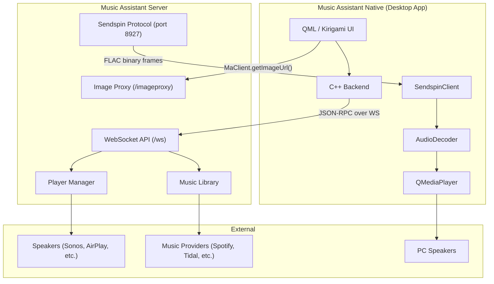
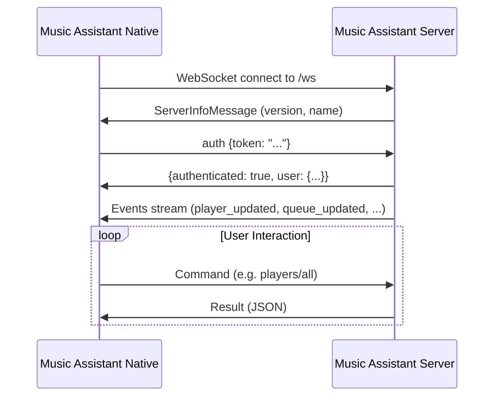
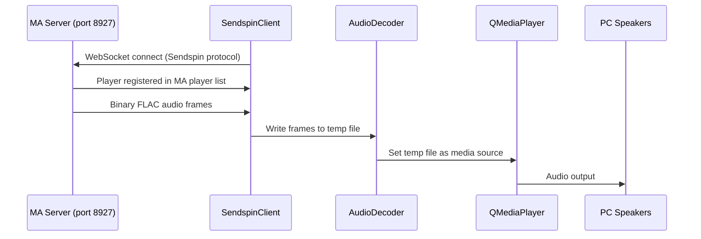

# Architecture

## Overview

Music Assistant Native is a native Qt6/KDE Frameworks 6 application that acts as both a **local audio player** and a **remote control** for a Music Assistant server. The app registers as a real MA player via the Sendspin protocol and can play audio through the PC speakers.



## Technology Stack

| Layer | Technology | Purpose |
|-------|-----------|---------|
| UI | QML + Kirigami | Declarative, Plasma-native interface |
| Backend | C++20 | WebSocket client, data models, controllers |
| Build | CMake + ECM | KDE-standard build system |
| Audio | Qt6 Multimedia | Local FLAC playback via QMediaPlayer |
| Packaging | RPM, DEB, AppImage | Linux distribution |
| Communication | WebSocket JSON-RPC | Real-time bidirectional with MA server |
| Audio Protocol | Sendspin (WebSocket) | Registers as MA player, receives FLAC audio frames |
| Images | QML Image + getImageUrl() | Direct image loading via MA image proxy URL |

## Component Overview

```
src/
├── main.cpp                 # App bootstrap, singleton wiring
├── maclient.h/cpp           # WebSocket client (core)
├── sendspinclient.h/cpp     # Sendspin audio protocol client
├── audiodecoder.h/cpp       # FLAC audio decoding + QMediaPlayer playback
├── playercontroller.h/cpp   # Player state & commands
├── queuecontroller.h/cpp    # Queue state & commands
├── librarycontroller.h/cpp  # Library browsing & search
├── mediaitemmodel.h/cpp     # QAbstractListModel for media items
├── playermodel.h/cpp        # QAbstractListModel for players
├── queueitemmodel.h/cpp     # QAbstractListModel for queue items
└── qml/
    ├── Main.qml             # App window, navigation, bottom bar
    ├── NowPlayingPage.qml   # Current track, art, controls
    ├── LibraryPage.qml      # Tabbed library browser
    ├── MediaItemDelegate.qml # Reusable list item delegate
    ├── QueuePage.qml        # Queue management
    ├── PlayersPage.qml      # Player list & volume
    └── SettingsPage.qml     # Server connection config
```

## Data Flow

### Connection Lifecycle



### Real-Time Updates

After authentication, the server pushes events automatically:

- **`player_updated`** — player state changes (volume, playback state, current track)
- **`queue_updated`** — queue state changes (shuffle, repeat, current index)
- **`queue_items_updated`** — queue contents changed (triggers re-fetch)
- **`media_item_added/updated/deleted`** — library changes

The controllers listen for these events and update their properties, which triggers QML UI updates via Qt's property binding system.

### Image Loading

Images are loaded directly via QML `Image` elements. The `MaClient.getImageUrl()` method builds the full image proxy URL (including authentication), and QML loads it as a standard HTTP image source — no custom image provider needed.

### Sendspin Audio Pipeline


